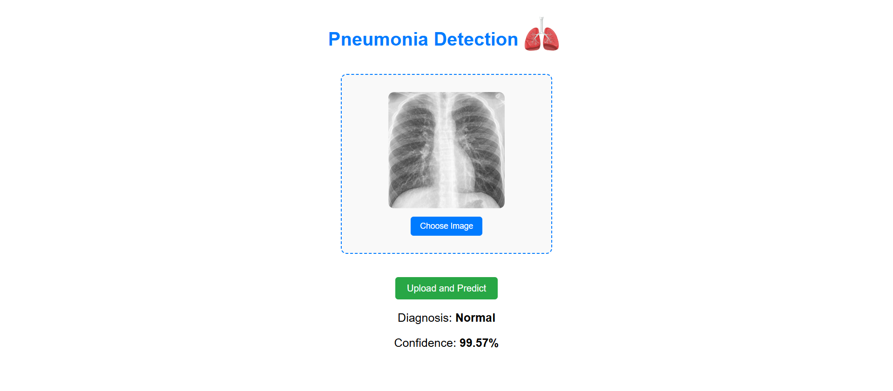

# 🩺 Pneumonia Detection App

This project is a full-stack Pneumonia Detection web application built using React for the frontend and FastAPI for the backend. It enables users to upload chest X-ray images and receive instant diagnostic predictions powered by a deep learning model.
The model, trained using TensorFlow, accurately detects signs of pneumonia and returns a confidence score for each prediction. The frontend offers a clean and user-friendly interface with both standard upload and drag-and-drop image input features.
Designed for simplicity and speed, the app delivers a seamless experience from image submission to diagnosis, making it suitable for medical screening prototypes and educational demonstrations in AI for healthcare.

---


---
## 📁 Project Structure

```markdown
pneumonia-detection-app/
├── AI/            # Download model here 
│   ├── main.py
│   ├── requirements.txt         
├── frontend/            # React app (Vite)
│   └── ...
├── README.md
```
---
## 🔗 Download the Model

Please download the trained model file from Google Drive:

👉 [Download Model](https://drive.google.com/file/d/1LxFji4dL__slKNgqRbhzvBl0eIV65hw2/view?usp=sharing)

Then, place the model file inside the AI folder.

---

## ⚙️ How to Run the FastAPI Server (Backend)

1. Navigate to the backend folder
   ```bash
   cd AI
   ```
2. Open the folder in your IDE (pycharm recommended)
3. Install dependencies
   ```bash
   pip install -r requirements.txt
   ```
4.Run the server
```bash
uvicorn main:app --reload
```
🔗 By default, the API runs on: http://127.0.0.1:8000

---

## 🖼️ How to Run the React App (Frontend)

1.Navigate to the frontend folder
```bash
cd frontend
```
2.Install dependencies
```bash
npm install
```
3.Run the app
```bash
npm run dev
```
🌐 The frontend will be available at: https://www.google.com/search?q=http://localhost:5173

---

## 📸 Features
- Upload or drag & drop an X-ray image
- Get real-time pneumonia prediction
- Confidence score
- React frontend + FastAPI backend

---
   


